<a href="https://metrics.lecoq.io/about/amirhessam88"></img></a>
<a href="https://metrics.lecoq.io/about/amirhessam88"></img></a>

- 🔭 Working on [Slick-ML](https://github.com/slickml/slick-ml)
- 🌱 Learning More Details on Development of a Open Source Software
- 👯 Open to Collaborate on Cool Machine Learning Projects & Publications
- 💬 Ask me about Data Science, Machine Learning & Scientific Computing
- ⚡ Support me by Buying Me a Coffee 

---

### Connect with me:
[][website]
[][linkedin]
[][gscholar]
[][rgate]

 
 

<!--

-->

---
<!--

-->

<!--  -->

    

[website]: https://www.amirhessam.com/
[linkedin]: https://www.linkedin.com/in/amirhessam/
[gscholar]: https://scholar.google.com/citations?user=CnHZjFAAAAAJ&hl=en/
[rgate]: https://www.researchgate.net/profile/Amirhessam_Tahmassebi/
[python]: https://www.python.org/
[git]: https://git-scm.com/
[github]: https://www.github.com/
[bash]: https://www.gnu.org/software/bash/
[opensuse]: https://www.opensuse.org/
[jupyter]: https://jupyter.org/
[pandas]: https://pandas.pydata.org/
[tensorflow]: https://www.tensorflow.org/
[pytorch]: https://pytorch.org/
[keras]: https://keras.io/
[vim]: https://www.vim.org/download.php

 
 

<!-- END OF README  -->

<!--
**amirhessam88/amirhessam88** is a ✨ _special_ ✨ repository because its `README.md` (this file) appears on your GitHub profile.

Here are some ideas to get you started:

- 🔭 I’m currently working on ...
- 🌱 I’m currently learning ...
- 👯 I’m looking to collaborate on ...
- 🤔 I’m looking for help with ...
- 💬 Ask me about ...
- 📫 How to reach me: ...
- 😄 Pronouns: ...
- ⚡ Fun fact: ...
-->
